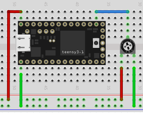

Analog
======

Here we have programs that demonstrate analog input.

**analog.c** is a program that reads the analog voltage on the A0 pin.  The
circuit used is:

**analog1.c** reads the voltage on A0 and serial.prints the value whenever
it changes.  Note that the value on pin A0 is in the range [0, 1023].
The code maps the pin value to the range [0, 255] and prints only when
the mapped value changes.  Note that we get some *jitter* in the value as we
see the following when there is no physical movement in the potentiometer:

  | pot value = 747, mapped value = 186
  | pot value = 746, mapped value = 185
  | pot value = 747, mapped value = 186
  | pot value = 746, mapped value = 185
  | pot value = 747, mapped value = 186
  | pot value = 746, mapped value = 185
  | pot value = 747, mapped value = 186
  | pot value = 746, mapped value = 185
  | pot value = 747, mapped value = 186
  | pot value = 746, mapped value = 185

**analog2.c** adds a little delta value and prints the values only if the 
absolute difference between the last mapped value and a new one is greater
than the delta.  A delta of 1 is enough to *smooth* the potentiometer values.

**analog3.c** takes the mapped potentiometer value and uses it to control the
flash rate of the builtin LED by code in loop().  One drawback of the approach
used (delay()) is any change at the potentiometer may not be apparent for up to
a second if quickly changing while LED is slowly flashing.  That's because the
code doesn't read the pot until the flash cycle is finished.

**analog4.c** is a rewrite of *analog3.c* to remove the flaw menioned above.
That is, we want the flashing to change immediately when the pot is changed.
We do this by controlling the flashing by using a timer and pot changes are 
noticed via interrupt.  This gets tricky as a pot change requires stopping 
running timers and restarting a flash cycle.
