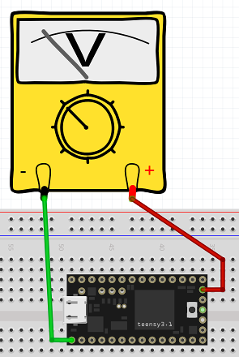

Analog_output
=============

Here we have programs that demonstrate analog output.

**analog.c** is a program that uses software delay() calls in loop() to write
a symmetric sawtooth output voltage on DAC output pin A14.  The layout used is:

