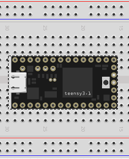

Blink
=====

The teensy `tutorials <https://www.pjrc.com/teensy/tutorial.html>`_ start
with a 'blink' example which is a very simple *hello world!* example that
blinks the on-board LED.  The circuit used for all the code here is just the
teensy 3.1 board itself:

**Blink.c** is the original teensy program, one second on, on second off.

**blink_double.c** blinks the LED twice rapidly with a one second repeat time.
Getting this to work exercises the Arduino build system.

**BlinkWithoutDelay.c** is a Blink.c variation where the current time is polled
in a loop allowing something to be done *besides* busy waiting.

**blink_without_delay_double.c** is a rewrite of *BlinkWithoutDelay.c* to
double blink the LED using the time poll approach.  This program uses a state
machine to handle the more complex double blink.  I've also added a second state
machine to handle printing something back to the serial monitor every 1.5
seconds.

**BlinkTimer.c** is a teensy demonstration program using timers.  Got it from
`here <https://www.pjrc.com/teensy/td_timing_IntervalTimer.html>`_.

**blink_timer_double.c** is my rewrite of *BlinkTimer.c* to double blink with
timers and the state machine approach.
