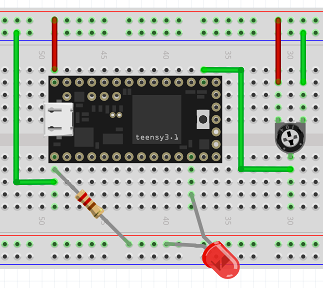

pwm
===

Here we have programs that show PWM I/O (Pulse Width Modulation).

**pwm.c** is a program that uses software delay() calls in loop() to write
a symmetric sawtooth output voltage on pin 10 (TX2).  The layout is:

.. image:: breadboard.png
    :width: 297
    :height: 476
    :alt: circuit used to test PWM output (http://fritzing.org/)

The 0.1uF capacitor is to smooth the PWM output somewhat.

**pwm_led.c** uses code similar to *pwm.c* to write a decreasing sawtooth
PWM voltage to pin 10 to light an LED.  The layout is:

.. image:: breadboard2.png
    :width: 223
    :height: 236
    :alt: circuit used to test PWM output (http://fritzing.org/)

**pwm_led2.c** just reads an analog voltage on A0 and writes a PWM signal to pin
10.  The layout is:

                                                                                             

