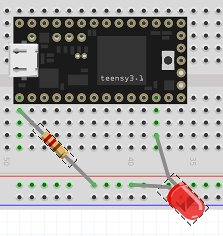

pwm
===

Here we have programs that show PWM I/O (Pulse Width Modulation).

**pwm.c** is a program that uses software delay() calls in loop() to write
a symmetric sawtooth output voltage on pin 10 (TX2).  The layout is:

The 0.1uF capacitor is to smooth the PWM outoput somewhat.

**pwm_led.c** uses code similar to *pwm.c* to write a decreasing sawtooth
PWM voltage to pin 10 to light an LED.  The layout is:

